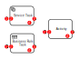
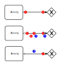

# imicros-flow
[](https://travis-ci.org/al66/imicros-flow)
[](https://coveralls.io/github/al66/imicros-flow?branch=master)
[](https://img.shields.io/badge/status-under_development-red)

Process engine of imicros framework (based on [Moleculer](https://github.com/moleculerjs/moleculer) services)

> ** Change in Version 0.3.*: Eventhandling based on Kafka moved to imicros-events! **   
    
## Installation
```
$ npm install imicros-flow --save
```
## Usage
The services `flow.token`, `flow.next`, `flow.activity`, `flow.sequence`, `flow.gateway`, `flow.process` are running worker services reacting on different events (namespace `flow.*`).

New processes are triggered by event subscriptions defined in process control and queried by service `flow.query` with action `subscripitions`.
Service `flow.event` is listening to each* submitted event in molculer and starts a new process if a subscription exsits.

*with exception of internal events `$**` or own submitted events `flow.*`.

## Dependencies
The engine requires additional running services of the following packages: 
- imicros-flow-control (service `flow.query`) for querying process defintion uses [Neo4j](https://neo4j.com/) as graph database
- imicros-flow-context (service `flow.context`) for storing the context of a running process uses [Cassandra](https://cassandra.apache.org/) as database
- imicros-flow-store (service `flow.store`) for storing element status of a running process uses [Cassandra](https://cassandra.apache.org/) as database
- imicros-acl (service `acl`) for checking authorizations
- imicros-rules (service `rules`) for evaluation business rules

But these services can also be replaced by own services with similar functionality - refer to the mocks in test/helper.

## BPMN Background 

### Support of the following [BPMN elements](https://www.bpmnquickguide.com/view-bpmn-quick-guide/) 
The goal is to cover all of them in the final version :wink:.

#### Activites

Activities  |  Types  |  Markers  
----------- | ------- | ---------
Task        | [ ] Send Task  <br/> [ ] Receive Task <br/> [ ] User Task <br/> [ ] Manual Task <br/> [x] Business Rule Task <br/> [x] Service Task <br/> [ ] Script Task | [ ] Parallel <br/> [ ] Sequential <br/> [ ] Ad Hoc  
Sub-Process  |         | [ ] Loop <br/> [ ] Parallel <br/> [ ] Sequential <br/> [ ] Ad Hoc <br/> [ ] Compensation
Event Sub-Process  |         | [ ] Loop <br/> [ ] Parallel <br/> [ ] Sequential <br/> [ ] Ad Hoc <br/> [ ] Compensation
Transaction  |         | [ ] Loop <br/> [ ] Parallel <br/> [ ] Sequential <br/> [ ] Compensation

#### Sequence Flow
-  [x] Standard Flow
-  [x] Conditional Flow
-  [x] Default Flow

#### Gateways
-  [x] Exclusive Gateway
-  [x] Event-based Gateway
-  [x] Parallel Gateway
-  [ ] Inclusive Gateway
-  [ ] Complex Gateway
-  [ ] Exclusive Event-based Gateway
-  [ ] Parallel Event-based Gateway

#### Events

Events         | Start                    | Intermediate             | End
-------------- | ------------------------ | ------------------------ | ------------------------
None (untyped) | [ ] Standard  | [ ] Throwing | [ ] Standard <br/> [ ] Terminate Immediatly
Message        | [ ] Standard <br/> [ ] Boundary Interrupting <br/> [ ] Boundary Non-Interrupting | [ ] Catching <br/> [ ] Boundary Interrupting <br/> [ ] Boundary Non-Interrupting <br/> [ ] Throwing | [ ] Standard
Timer (1)      | [x] Standard <br/> [ ] Boundary Interrupting <br/> [ ] Boundary Non-Interrupting | [x] Catching <br/> [ ] Boundary Interrupting <br/> [ ] Boundary Non-Interrupting | 
Escalation     | [ ] Boundary Interrupting <br/> [ ] Boundary Non-Interrupting | [ ] Boundary Interrupting <br/> [ ] Boundary Non-Interrupting  [ ] Throwing | [ ] Standard
Conditional    | [ ] Standard <br/> [ ] Boundary Interrupting <br/> [ ] Boundary Non-Interrupting | [ ] Catching <br/> [ ] Boundary Interrupting <br/> [ ] Boundary Non-Interrupting | 
Error          | [ ] Boundary Interrupting | [ ] Boundary Interrupting | [ ] Standard
Cancel         |  | [ ] Boundary Interrupting | [ ] Standard
Compensation   | [ ] Boundary Interrupting | [ ] Boundary Interrupting <br/> [ ] Throwing | [ ] Standard
Signal         | [x] Standard <br/> [ ] Boundary Interrupting <br/> [ ] Boundary Non-Interrupting | [ ] Catching <br/> [ ] Boundary Interrupting <br/> [ ] Boundary Non-Interrupting <br/> [ ] Throwing | [ ] Standard
Multiple       | [ ] Standard <br/> [ ] Boundary Interrupting <br/> [ ] Boundary Non-Interrupting | [ ] Catching <br/> [ ] Boundary Interrupting <br/> [ ] Boundary Non-Interrupting <br/> [ ] Throwing | [ ] Standard
Parallel Multiple  | [ ] Standard <br/> [ ] Boundary Interrupting <br/> [ ] Boundary Non-Interrupting | [ ] Catching <br/> [ ] Boundary Interrupting <br/> [ ] Boundary Non-Interrupting | 

(1) Start timer event currently supports only cron syntax for scheduling. The intermediate timer event supports only to wait a specific time defined by given month/days/hours/seconds which are added to the date when the event is activated.


### Concept of token
According to [BPMN Execution Semantics](https://www.omg.org/spec/BPMN/2.0/PDF/):

The process flow of each instance is controlled by token. If a new process element (event, sequence, task, gateway or subprocess) is activated, a corresponding token with an initial status is emitted (event `flow.token.emit`). 

The token handler is reading the emitted tokens will initiate the next step by processing the token.

If the token is processed, at least the status changes. The processed token is consumed (event `flow.token.consume`) and new tokens are issued.

#### Activity


(1) ACTIVITY_ACTIVATED
- Service Task: if a ruleset is given 
    - get values from context for given input keys
    - evaluate ruleset for preparation of action parameters
    - store action parameters in the context
    - emit token `ACTIVITY_READY`
- Others: pass through, emit token `ACTIVITY_READY`

(2) ACTIVITY_READY
- Service Task: 
    - get values from context for the given parameters key
    - call given service action and save result in context under the given key for the result
    - in case of errors: emit token `ACTIVITY_ERROR`
    - otherwise: emit token `ACTIVITY_COMPLETED`
- Business Rule Task:
    - get values from context for given input keys
    - evaluate ruleset
    - store result in the context under the given key
    - in case of errors: emit token `ACTIVITY_ERROR`
    - otherwise: emit token `ACTIVITY_COMPLETED`

(3) ACTIVITY_COMPLETED
- All: 
    - emit `flow.next`

(4) ACTIVITY_ERROR

#### Sequence


(1) SEQUENCE_ACTIVATED
- Standard Sequence (and received token without attribute `exclusiveGateway`):
    - pass through, emit token `SEQUENCE_COMPLETED`
- Conditional Sequence or received token with attribute `exclusiveGateway`:
    - get values from context for given input keys
    - evaluate ruleset
    - if the result for the given result key === true: emit token `SEQUENCE_COMPLETED`
    - if the result for the given result key != true: emit token `SEQUENCE_REJECTED`
    - emit `flow.sequence.evaluated`
- Default Sequence:
    - do nothing ( waiting for events `flow.sequence.evaluated` )

(2) SEQUENCE_COMPLETED
- All: 
    - emit `flow.next`

(3) SEQUENCE_REJECTED


(4) SEQUENCE_ERROR

(a) `flow.sequence.evaluated`

Each token emitted by handling of `flow.next` has the attributes *defaultSequence* and *waitFor* if one of the outgoing sequences is a default sequence. *defaultSequence* is the element id of an outgoing default sequence. *waitFor* is an array of all other outgoing sequences.

The event handler of `flow.sequence.evaluated`
- save the received token in the context of the default sequence element
- get all received token saved in the context and check if they are complete against the array *waitFor*
- if the received token are complete and all are rejected: emit token `SEQUENCE_COMPLETED`
- if the received token are complete and any of them is completed: emit token `SEQUENCE_REJECTED`

#### Gateway


(1) GATEWAY_ACTIVATED
- split:
    - set attribute `exclusiveGateway` in new token for flow control by outgoing sequences
    - emit token `GATEWAY_COMPLETED`
- merge:
    - pass through, emit token `GATEWAY_COMPLETED`

(2) GATEWAY_COMPLETED
- split & merge:
    - emit `flow.next`

